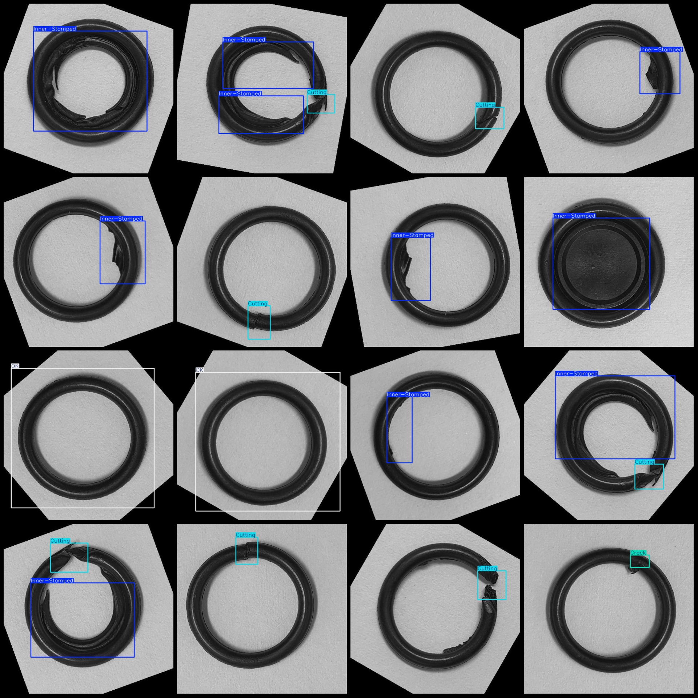
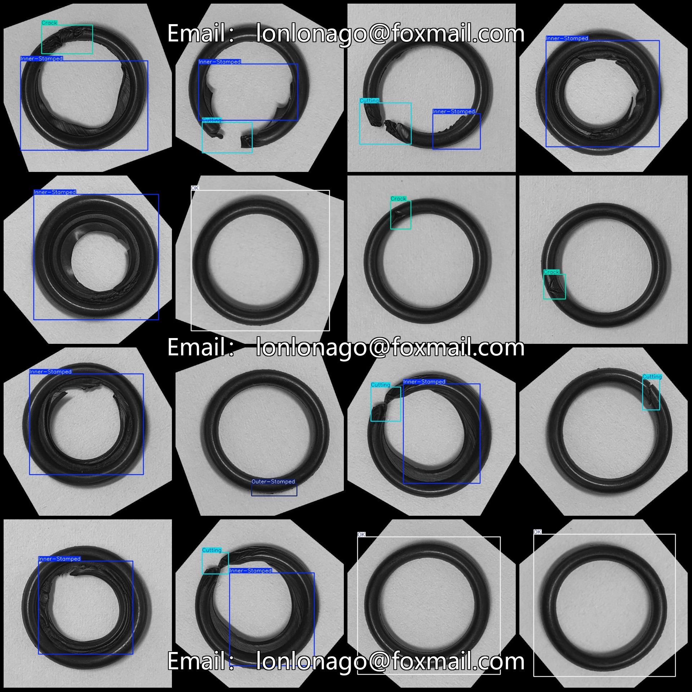

# VOC+YOLO Dataset for Sealant Ring Quality Testing and Defect Detection

## Data formatDescription

This dataset follows the Pascal VOC format and YOLO format. It does not include split paths in a txt file, but only includes jpg images along with corresponding VOC format xml files and YOLO format txt files.

### Number of images

- jpg files count: 1296

### Number of annotations

- The number of XML files: 1296

- Number of text files: 1296

### Annotation class number

- Number of categories: 5 ("Crack", "Cutting", "Inner-Stamped", "OK", "Outer-Stamped")

### Category Name Labeling

- Note: The order of the yolo format classes may differ from this description, and should be based on the classes.txt in the labels folder.

```plaintext
["Crack"、"Cutting"、"Inner-Stamped"、"OK"、"Outer-Stamped"]
```

### Frame Counts Statistics

- Crack Frames: 266
- Cutting Frames: 318
- Inner Stamped Frames: 866
- OK Frames: 175
- Outer Stamped Frames: 191
- Total Frames: 1816

The number of photos owned.

- Crack: 247
- Cutting: 318
- Inner-Stamped: 735
- OK: 175
- Outer-Stamped: 190

### Images resolution

- Each image size: 640x640 pixels

### Markup Tool

- Use labelImg: LabelImg

### Annotation Rules

- Draw a rectangle around the category

### Important Notice

- The dataset is not divided into training, validation, and test sets, so you need to do it yourself.
- This dataset does not guarantee the accuracy of the trained model or weight file.

### Images Preview

Due to the platform's inability to directly display images, please visit the provided data link to view the actual image.
## Images





Here is a pay link on Stripe ( https://buy.stripe.com/3cs8yP7sY87d0vu9AB ). Please contact me lonlonago@foxmail.com after funding $89, and I will send you a complete data files , thank you!

